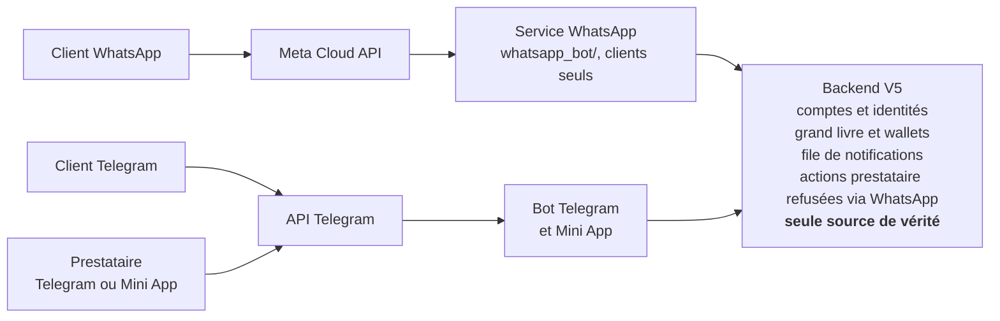

# Architecture du canal WhatsApp client — Nexis Hub

2 octobre 2026. Validé par Ben (toutes les questions ouvertes tranchées le
même jour, voir la dernière section), complété le même soir après la relecture
de Codex (liaison contestée, envoi incertain, conservation des données,
exploitation). **Ce fichier est la référence** ; la première version de
travail (https://claude.ai/code/artifact/289f536c-f696-490f-a85a-b41a86f6a2c7)
ne contient pas ces compléments.

## Objet et décisions déjà prises

Nexis Hub ouvre un canal WhatsApp réservé aux clients, parce que Telegram est peu utilisé à Kinshasa. Ce document décrit l'architecture cible de ce canal. Aucune ligne de code WhatsApp n'est écrite avant que les étapes qui le précèdent (chantier argent, compte Nexis) soient terminées.

Décisions prises par Ben le 2 octobre 2026 :

1. **Clients** : ils choisissent WhatsApp ou Telegram.
2. **Prestataires** : ils passent obligatoirement par le bot Telegram, la Mini App ou, plus tard, l'application Nexis. Aucun parcours prestataire n'existe sur WhatsApp.
3. **Un seul compte client** : un même client peut relier Telegram et WhatsApp à un seul compte et un seul wallet. La liaison est vérifiée par le numéro de téléphone.
4. **Refus explicite** : une personne qui demande à s'inscrire comme prestataire sur WhatsApp reçoit un refus clair et un lien vers Telegram ou la Mini App.

## État actuel vérifié dans le dépôt

Aucun code WhatsApp n'existe, et le backend est entièrement construit autour de l'identifiant Telegram. Vérifié sur `feature/v5-migration`, commit `d3f3b1b`.

| Constat | Preuve |
| --- | --- |
| Le plan prévoit un canal WhatsApp en 4 lignes, conditionné à un backend indépendant du canal | `V5_MIGRATION_PLAN.md:503-509` (avant cette mise à jour) |
| Le client est identifié par son `telegram_id`, clé primaire de la table, et son wallet y est accroché | `backend/app/models.py:11-17` |
| Le prestataire aussi, avec son propre wallet | `backend/app/models.py:24-43` |
| Missions, devis, avis et demandes de service référencent client et prestataire par `telegram_id` | `backend/app/models.py:55-127` |
| Toutes les routes du backend prennent un `telegram_id` dans l'URL | `backend/app/main.py:276-745` |
| Les notifications du backend ne partent que par l'API Telegram | `backend/app/notify.py:14`, appelé depuis `backend/app/tasks.py:53-149` |
| La Mini App authentifie par la signature Telegram (`initData`) | `mini_app/app.py:119` |
| Le paiement mobile money est simulé | `telegram_bot/payment.py:142` (`operator="mobile_money_simulation"`) |
| Le mot « WhatsApp » n'apparaît que pour demander le numéro de téléphone à l'inscription Telegram | `translations/fr.json:155`, `telegram_bot/keyboards.py:184` |

En plus, `db.py` (SQLite) porte encore une partie de la vérité métier. Le canal WhatsApp ne peut pas s'appuyer sur `db.py` : il ne parle qu'au backend.

**Mise à jour du 2 octobre au soir.** Le chantier « backend seule source de vérité de l'argent » (branche `feature/argent-backend`, commit `0002b7e`, pas encore fusionnée) a déjà posé la base d'identité (`CONCEPTION_ARGENT.md`, section « Comptes Nexis ») :

- tables `accounts` et `channel_identities` ; un compte par `telegram_id` connu, avec son identité `telegram` (commit `298ce9e`) ;
- registre en partie double qui ne connaît que le compte, jamais un identifiant de canal ; un seul wallet par personne (soldes client et prestataire additionnés à la migration) ;
- missions payées liées à `client_account_id` et `provider_account_id` ;
- refus d'un prestataire sur sa propre mission (`provider_is_client`).

Restent pour le chantier d'identité WhatsApp : rôles et numéro vérifié du compte, passage des autres tables (missions, devis, avis) à `account_id`, liaison entre canaux, notifications.

## Principes non négociables

Le canal WhatsApp est un affichage et une prise de commande, jamais un endroit où l'argent se décide.

1. **Le backend est la seule source de vérité.** Identité, missions, devis, paiements, wallets, libérations, litiges et remboursements sont décidés par le backend, en une transaction. Le service WhatsApp n'a pas de base métier à lui.
2. **Le service WhatsApp n'importe jamais `db.py`.** Il ne parle au backend que par son API authentifiée.
3. **Backend injoignable, aucune action d'argent.** Le client reçoit un message d'indisponibilité et réessaie. Aucune file locale ne rejoue une action d'argent à sa place.
4. **Chaque action est idempotente.** Un message WhatsApp peut arriver deux fois (Meta réessaie ses webhooks). Chaque appel au backend porte une clé d'idempotence dérivée de l'identifiant du message WhatsApp.
5. **Les règles métier sont écrites une seule fois.** Commissions, statuts, délais et droits sont dans le backend. Telegram et WhatsApp appellent les mêmes endpoints et obtiennent les mêmes résultats au centime.
6. **Tout webhook entrant est authentifié.** Signature `X-Hub-Signature-256` vérifiée en temps constant, sinon rejet, comme le webhook Telegram aujourd'hui (`telegram_bot/webhook_server.py`).
7. **Les textes passent par les fichiers de traduction** (fr, ln, en), jamais écrits en dur.

## Architecture cible

Un compte Nexis unique porte l'argent, et chaque canal n'est qu'une porte d'entrée rattachée à ce compte.

Le service WhatsApp et le bot Telegram ne décident rien : ils transmettent au backend, qui tient les comptes, l'argent et les règles. Les notifications repartent du backend par le même chemin, sur le canal de chaque personne.

### Identité : compte Nexis et identités de canal

| Table | Rôle | Champs clés | Contraintes |
| --- | --- | --- | --- |
| `accounts` | La personne. Clients et prestataires. | `account_id`, `roles` (client, provider, ou les deux), `phone_e164`, `language`, `created_at` | `phone_e164` unique pour les comptes vérifiés |
| `channel_identities` | Une porte d'entrée vers un compte | `account_id`, `channel` (telegram, whatsapp, miniapp, app), `external_id` (id Telegram ou `wa_id`), `verified_at` | Unique sur (`channel`, `external_id`) ; un seul canal de chaque type par compte |
| Wallet et grand livre | Définis par le chantier argent | Rattachés à `account_id`, jamais à un canal | Voir le chantier argent |

Missions, devis, transactions, avis et litiges référencent `account_id` au lieu de `telegram_id`. Le prestataire utilise le même modèle. C'est ce qui permettra plus tard l'application Nexis sans nouvelle migration.

**Règle de rôle dans le backend :** un compte `provider` ne peut avoir que des identités `telegram`, `miniapp` ou `app` pour ses actions de prestataire. Le backend refuse toute action prestataire venant d'une identité `whatsapp`. La règle n'est pas confiée au service WhatsApp.

**Compte avec deux rôles :** un prestataire peut aussi commander comme client, avec le même compte et le même wallet. Sur Telegram et la Mini App, il passe d'un mode à l'autre. Le backend refuse tout devis d'un prestataire sur une mission dont il est le client.

### Routage des notifications

Le backend écrit chaque notification dans une table `notifications` dans la même transaction que l'événement métier (paiement reçu, mission libérée, litige ouvert). Une tâche Celery envoie ensuite chaque ligne sur le canal préféré du destinataire et enregistre le résultat. L'envoi direct actuel (`backend/app/notify.py:14`) est remplacé par cette table pour les deux canaux.

**Ce qui est garanti, et ce qui ne l'est pas.**

- Une notification n'est jamais perdue en silence : tant qu'elle n'est pas confirmée, elle reste à traiter, avec un nombre d'essais et la dernière erreur.
- Le backend ne crée qu'une seule notification par événement (contrainte d'unicité sur l'événement et le destinataire) : un événement rejoué ne produit pas une deuxième notification.
- **Le « zéro doublon » à l'arrivée n'est pas garanti**, et le document ne le promet pas. Si la requête d'envoi part et que la réponse de Meta (ou de Telegram) se perd, le backend ne peut pas savoir si le message a été accepté. Aucune des deux API n'offre de clé d'idempotence à l'envoi.
- **Aucune notification ne porte d'action d'argent.** L'argent est décidé par le backend avant la notification ; un message reçu deux fois, ou pas reçu, ne change aucun solde. Le client retrouve toujours l'état exact par le menu « Mes missions » ou « Mon solde ».

**États d'une notification :** `pending` (à envoyer), `sending` (requête partie), `sent` (accepté par le fournisseur, identifiant de message enregistré), `uncertain` (requête partie sans réponse : délai dépassé ou connexion coupée), `failed` (refus explicite du fournisseur, par exemple modèle refusé ou numéro invalide).

**Règle pour l'état `uncertain` :**

1. WhatsApp : chaque envoi porte l'identifiant de la notification dans `biz_opaque_callback_data`, que Meta renvoie dans ses webhooks de statut ([référence Meta](https://developers.facebook.com/documentation/business-messaging/whatsapp/webhooks/reference/messages/status)). Si un statut `sent`, `delivered` ou `read` arrive avec cet identifiant, la notification passe à `sent` sans renvoi.
2. Sans statut au bout de 15 minutes, une seule nouvelle tentative. Un doublon reste possible dans ce cas rare, et il est sans conséquence (point précédent).
3. Telegram n'a pas d'équivalent : une seule nouvelle tentative après 15 minutes.
4. Après 3 échecs ou une seconde incertitude, la notification passe à `failed` et apparaît dans la surveillance (section Exploitation). Le client verra l'état à jour à son prochain message.
5. Les textes de notification sont écrits pour supporter une répétition : ils nomment la mission et l'état (« Paiement reçu pour la mission NXH-1234 »), jamais une instruction à exécuter.

### Composants

- **Service WhatsApp** (`whatsapp_bot/`, processus séparé) : reçoit les webhooks de Meta, vérifie la signature, déduplique, garde l'état de conversation et appelle le backend.
- **Backend V5** : seule source de vérité. Nouveaux endpoints indexés par `account_id`, authentifiés par clé de service par canal.
- **Expéditeur de notifications** (Celery) : lit `notifications` et envoie par Telegram ou WhatsApp.
- **Bot Telegram et Mini App** : inchangés dans leur rôle, mais appellent les endpoints par `account_id`.

L'état de conversation WhatsApp (étape en cours d'un client) vit dans Redis, déjà en place. Il ne contient aucune donnée d'argent : perdu, le client recommence l'étape.

## Parcours client sur WhatsApp et contraintes de l'API

Le client WhatsApp fait les mêmes choses que le client Telegram, mais avec des boutons et des listes plus pauvres et une règle stricte sur les messages envoyés sans qu'il ait écrit.

### Contraintes de l'API WhatsApp

| Contrainte | Effet sur Nexis |
| --- | --- |
| 3 boutons de réponse maximum, 20 caractères par bouton | Chaque choix oui/non ou à 3 options tient en boutons ; les libellés lingala doivent être courts et relus |
| Listes de 10 lignes maximum | Services et communes de Kinshasa doivent être présentés par groupes (par exemple district, puis commune) |
| Fenêtre de 24 h après le dernier message du client | Dans la fenêtre : message libre gratuit. Hors fenêtre : uniquement un modèle validé par Meta |
| Modèles « utilité » (suivi de transaction) | Gratuits dans la fenêtre de 24 h, facturés par message en dehors |
| Modèles « marketing » | Toujours facturés, consentement requis. Nexis n'en utilise pas dans ce chantier |
| Pas de Mini App | Aucun écran riche ; tout passe par messages, boutons, listes, localisation et photos |

Source : [tarification Meta](https://developers.facebook.com/docs/whatsapp/pricing) (facturation par message depuis le 1er juillet 2025) et [boutons de réponse](https://developers.facebook.com/docs/whatsapp/cloud-api/messages/interactive-reply-buttons-messages).

### Parcours

La saisie se fait en conversation pas à pas (décision de Ben) : listes, texte, localisation. Pas de formulaires WhatsApp Flows.

| Parcours | Sur WhatsApp | Notification hors fenêtre (modèle utilité à faire valider) |
| --- | --- | --- |
| Inscription | Choix de la langue (3 boutons), nom ; le numéro est le `wa_id`, déjà vérifié par WhatsApp | Aucune |
| Créer une mission | Service (liste), commune (liste en deux niveaux), description (texte), localisation (partage de position WhatsApp) | Aucune |
| Recevoir et choisir un devis | Devis affiché avec boutons Accepter / Refuser | « Nouveau devis pour votre mission » |
| Payer | Lien ou demande de paiement mobile money émise par le backend ; confirmation par le backend uniquement | « Paiement reçu » |
| Suivre la mission | Messages d'état (démarrée, terminée) | « Mission démarrée », « Mission terminée, confirmez » |
| Confirmer la fin et noter | Boutons Confirmer / Signaler un problème, puis note | « Paiement libéré » |
| Ouvrir un litige | Motif en liste, puis texte libre | « Litige ouvert », « Litige résolu » |
| Voir missions et solde | Commandes par menu (liste) | Aucune |

Le paiement réel est un prérequis commun : aujourd'hui il est simulé (`telegram_bot/payment.py:142`). Le canal WhatsApp n'ouvre pas à de vrais clients tant que le paiement mobile money réel (Phase 6) n'est pas en place, exactement comme Telegram.

## Liaison Telegram et WhatsApp, refus prestataire

Deux canaux ne sont reliés à un même compte que si la personne prouve qu'elle contrôle les deux. Le numéro seul ne suffit jamais.

### Ce que vaut un numéro

| Source du numéro | Prouvé ? | Pourquoi |
| --- | --- | --- |
| `wa_id` WhatsApp | Oui | WhatsApp a vérifié le numéro par SMS |
| Bouton « Partager mon numéro » Telegram, si le contact envoyé est celui de l'expéditeur | Oui | Telegram a vérifié le numéro du compte |
| Numéro tapé à la main sur Telegram (permis aujourd'hui, `translations/fr.json:155`) | Non | N'importe qui peut taper le numéro d'un autre |

`accounts.phone_e164` n'est unique que pour les numéros prouvés. Un numéro tapé par un compte existant reste enregistré, marqué non vérifié. Pour les nouveaux comptes Telegram, le bouton « Partager mon numéro » devient obligatoire (décision de Ben).

### Règles de liaison

1. **Numéro WhatsApp inconnu** : le backend crée un compte client et une identité `whatsapp` vérifiée.
2. **Numéro WhatsApp déjà porté par un compte client Telegram** : pas de liaison automatique. Le client choisit « Lier mon compte Telegram ». Le backend envoie un code à 6 chiffres sur Telegram ; le client le tape sur WhatsApp. La liaison ajoute l'identité `whatsapp` au compte existant. Le wallet ne bouge pas, il appartient déjà au compte.
3. **Code** : stocké sous forme de hachage, valable 10 minutes, usage unique, 5 essais au plus puis blocage d'une heure. Jamais écrit dans les journaux.
4. **Le numéro Telegram était tapé, donc non prouvé** : le titulaire WhatsApp, lui, est prouvé. La liaison passe quand même par le code Telegram. Sans code, le backend crée un compte WhatsApp séparé et signale le conflit à l'admin, sans toucher à aucun wallet.
5. **Deux comptes portant chacun un solde** : jamais fusionnés automatiquement. Le regroupement est une opération du registre, décrite dans les cas difficiles ci-dessous.
6. **Chaque liaison et déliaison** est inscrite dans un journal d'audit (qui, quand, quel canal, résultat).
7. **Changement de numéro, perte d'accès, conflit** : voir les cas difficiles ci-dessous.

### Cas difficiles : liaison impossible, contestée ou en conflit

Principe : aucune base de données n'est jamais modifiée à la main, et aucun wallet n'est fusionné hors du registre. Chaque cas ci-dessous passe par une opération du backend, tracée dans le journal d'audit, testée comme le reste.

À Kinshasa, les opérateurs réattribuent les numéros inactifs. **Un numéro prouvé aujourd'hui ne prouve donc pas qu'on est la personne qui l'avait hier.** C'est pourquoi le numéro seul ne suffit jamais à rattacher un compte qui a déjà un historique ou un solde.

| Cas | Règle |
| --- | --- |
| **Plus d'accès à Telegram** (téléphone perdu, compte supprimé) et la personne veut retrouver son compte depuis WhatsApp | Pas de code possible. Procédure de récupération admin (ci-dessous). En attendant, la personne peut utiliser WhatsApp avec un nouveau compte sans solde |
| **Numéro changé** (nouvelle carte SIM) | Nouveau `wa_id`, donc nouvelle identité. Rattachement par code envoyé sur l'autre canal encore actif. Si aucun canal n'est actif : procédure de récupération admin. L'ancienne identité WhatsApp est désactivée au rattachement de la nouvelle |
| **Numéro WhatsApp déjà prouvé sur un autre compte, sans liaison possible** (numéro réattribué, ou personne qui ne peut pas recevoir le code) | Le backend crée un nouveau compte pour le titulaire actuel du numéro. Le numéro de l'ancien compte passe à « à revérifier » ; l'ancien compte garde son wallet et son historique. Alerte admin. Aucun argent ne bouge |
| **Deux comptes avec solde appartenant à la même personne** (par exemple un compte Telegram ancien et un compte WhatsApp créé ensuite) | Opération de regroupement (ci-dessous). Jamais de fusion automatique |
| **Liaison contestée** (la personne dit ne pas avoir lié son compte) | Pendant 30 jours après une liaison, l'autre canal du compte peut la contester par un bouton. L'identité ajoutée est suspendue aussitôt (plus aucune action, ni lecture du solde), l'admin tranche avec le journal d'audit |

**Procédure de récupération admin.**

1. La personne écrit depuis le canal qu'elle contrôle et demande la récupération.
2. Le backend ouvre une demande et pose des questions sur l'historique du compte : montant et date d'une mission payée, commune, nom d'un prestataire. Les réponses sont comparées par le backend, jamais montrées à l'admin à l'avance.
3. L'admin valide ou refuse dans le bot admin. Une validation rattache la nouvelle identité au compte.
4. Délai de sécurité de 72 heures après une récupération : le wallet ne peut être débité depuis la nouvelle identité (paiement par wallet, futur retrait), et chaque canal encore joignable du compte est prévenu et peut contester.
5. Tout est inscrit dans le journal d'audit : demande, réponses (correctes ou non), décision, admin, dates.

**Opération de regroupement de deux comptes.**

1. La personne prouve qu'elle contrôle les deux comptes : un code sur un canal de chacun des deux.
2. Conditions : aucune mission en escrow, en cours ou en litige sur le compte qui sera fermé.
3. Le backend déplace le solde par **une seule opération du registre** (wallet du compte fermé vers wallet du compte conservé), idempotente, comme toute opération d'argent.
4. Les identités de canal passent au compte conservé ; le compte fermé ne peut plus rien faire, mais son historique reste lisible.
5. Validation par l'admin, journal d'audit, notification sur tous les canaux des deux comptes.

### Refus prestataire

- Le menu WhatsApp ne propose aucune option prestataire.
- Si la personne demande à devenir prestataire, le bot répond par un message fixe (fr, ln, en) avec le lien du bot Telegram et de la Mini App.
- Le backend refuse de lui-même toute création ou action prestataire venant d'une identité `whatsapp`. Le service WhatsApp ne peut donc pas contourner la règle, même par erreur.
- Si le numéro WhatsApp appartient déjà à un compte prestataire, le bot lui indique d'utiliser Telegram ou la Mini App pour ses actions de prestataire. Il peut en revanche y commander comme client.

## Fournisseur de l'API et prérequis Meta

Décision : l'API WhatsApp Cloud de Meta en direct, sans intermédiaire.

| Option | Pour | Contre |
| --- | --- | --- |
| **Cloud API Meta en direct (retenu)** | Pas de marge d'intermédiaire, pas de dépendance de plus, documentation officielle, nouveautés Meta disponibles dès leur sortie | Tout l'onboarding Meta à faire soi-même |
| Twilio | Onboarding guidé, bibliothèque Python, support | Marge par message en plus du prix Meta, un fournisseur de plus entre Nexis et ses clients |
| 360dialog | Abonnement fixe, prix Meta repassés | Abonnement mensuel, un fournisseur de plus |

Le code appelle une API HTTPS et reçoit des webhooks dans tous les cas. Isoler l'envoi et la réception derrière une seule interface dans `whatsapp_bot/` permet de changer de fournisseur sans toucher au reste.

### Prérequis à obtenir par Ben, avant le code de production

- [ ] Compte Meta Business (portefeuille d'entreprise) **vérifié**, avec les documents de l'entreprise Nexis Hub.
- [ ] Un numéro de téléphone dédié, non utilisé dans l'application WhatsApp.
- [ ] Nom d'affichage « Nexis Hub » approuvé par Meta.
- [ ] Modèles utilité approuvés, en français, lingala et anglais (liste dans les parcours).
- [ ] **Hébergement public HTTPS stable** pour le webhook. Le PC avec ngrok ne convient pas : Meta exige une URL fixe, et un webhook éteint fait perdre des messages clients. C'est déjà un bloquant de lancement identifié pour Telegram.
- [ ] Moyen de paiement enregistré chez Meta pour les modèles facturés.

Le développement et les tests peuvent commencer avec le numéro de test fourni par Meta, sans attendre la vérification.

## Conservation des données WhatsApp

Nexis ne garde d'un message WhatsApp que ce dont une mission ou un litige a besoin, et rien de lisible dans les journaux.

| Donnée | Où | Durée | Remarque |
| --- | --- | --- | --- |
| `wa_id` (le numéro) | `channel_identities` | Durée de vie du compte | Supprimé à la clôture du compte ; le registre ne garde que `account_id` |
| Corps brut des webhooks | Nulle part | Jamais stocké | Le service extrait les champs utiles puis jette le reste |
| Identifiant de message reçu, pour la déduplication | Redis | 7 jours | Seul l'identifiant, sans contenu |
| État de conversation (étape en cours) | Redis | 24 heures sans activité | Aucune donnée d'argent ; perdu, le client recommence l'étape |
| Description de mission, commune, localisation | Mission (backend) | Comme les missions Telegram aujourd'hui | Même règle quel que soit le canal |
| Motif et texte de litige | Litige (backend) | Comme les litiges Telegram aujourd'hui | Même règle quel que soit le canal |
| Photos, vocaux, documents envoyés par le client | Non acceptés dans cette version | Non stockés | Le bot répond qu'il ne les traite pas ; les accepter demandera une règle de stockage propre |
| Codes de liaison | Backend, haché | Effacés à l'usage ou à l'expiration (10 minutes) | Jamais en clair |
| Journal d'audit (liaisons, récupérations, regroupements) | Backend | Au moins aussi longtemps que les opérations d'argent du compte | Durée légale à confirmer (question ouverte) |

**Jamais dans les journaux applicatifs :** numéro en clair (masqué, par exemple `+243•••••12`), texte des messages, localisation, codes de liaison, jeton d'accès Meta, secret d'application, signature des webhooks. Les journaux portent l'identifiant de notification ou de mission, l'état et le code d'erreur.

**Suppression à la demande du client :** possible si le solde est nul et qu'aucune mission n'est ouverte. Les identités de canal et le numéro sont effacés ; le registre garde les opérations passées sous `account_id`, sans donnée personnelle.

Meta conserve aussi des messages de son côté selon ses propres conditions. La politique de confidentialité de Nexis doit le mentionner avant l'ouverture.

## Exploitation du canal

Un bot qui marche sur le numéro de test peut être indisponible pour les vrais clients si personne n'exploite le canal. Ces points sont des prérequis de l'étape 8, pas des détails.

**Responsable.** Ben est aujourd'hui le seul exploitant : propriétaire du compte Meta Business, destinataire des alertes, admin des récupérations. Toute personne ajoutée plus tard reçoit un accès nominatif, jamais un jeton partagé.

**Hébergement.** Le webhook WhatsApp tourne sur le même hébergement public HTTPS stable que le backend. C'est le bloquant « pas d'hébergement » déjà relevé dans le bilan avant lancement (`point-lancement/avant-lancement-2026-10-02.md`) : tant qu'il n'est pas levé, WhatsApp n'ouvre pas. Sauvegarde de la base Postgres testée avant l'ouverture (même bilan).

**Secrets Meta.**

| Secret | Usage | Règle |
| --- | --- | --- |
| Jeton d'accès d'un utilisateur système Meta | Envoyer les messages | Gestionnaire de secrets de l'hébergement, jamais dans le dépôt ni dans `.env` commité ; renouvellement documenté |
| Secret d'application | Vérifier la signature des webhooks | Même règle ; un secret différent entre test et production |
| Jeton de vérification du webhook | Validation initiale de l'URL par Meta | Même règle |
| Identifiant du numéro et du compte WhatsApp Business | Adresser l'API | Configuration, pas un secret, séparée par environnement |

**Surveillance et alertes**, envoyées à Ben par le bot admin Telegram :

- rejets de signature de webhook (un pic signale une attaque ou un secret mal configuré) ;
- taux d'échec d'envoi, notifications `failed` ou `uncertain` en attente ;
- webhooks Meta de changement de qualité du numéro, de restriction du compte, de modèle en pause ou refusé ;
- webhook WhatsApp injoignable (contrôle de santé externe).

**Incidents.**

| Incident | Effet | Réponse |
| --- | --- | --- |
| Numéro restreint ou suspendu par Meta | Plus aucun message WhatsApp | Les notifications des clients liés à Telegram partent sur Telegram. Pour les clients WhatsApp seuls, elles restent en attente et partent au retour du numéro. L'argent n'est pas touché. Recours auprès du support Meta Business |
| Modèle refusé ou mis en pause | Notifications hors fenêtre de 24 h bloquées pour ce modèle | Elles restent en attente avec la raison ; alerte ; texte corrigé et resoumis. Dans la fenêtre de 24 h, le message libre continue |
| Hébergement en panne | Webhooks non reçus, rien n'est envoyé | Meta renvoie ses webhooks pendant un temps ; la déduplication évite les doubles actions au retour. Aucune action d'argent sans backend (principe 3) |
| Secret compromis | Risque de faux webhooks ou d'envois au nom de Nexis | Révocation et remplacement immédiats, procédure écrite et testée avant l'ouverture |

Le manuel d'exploitation (ces procédures, pas à pas) est écrit et relu à l'étape 8, avant l'ouverture.

## Découpage en étapes

Le canal WhatsApp vient après le chantier argent, et le compte Nexis doit être conçu avec lui pour ne pas migrer l'argent deux fois. Chaque étape est une session à part, relue (`security-reviewer`, `backend-parity-auditor`), testée, puis poussée sur une branche dédiée. Rien n'arrive sur `feature/v5-migration` dans un état intermédiaire.

| Étape | Contenu | Dépend de | Livré quand |
| --- | --- | --- | --- |
| 0. Accord avec le chantier argent | Le grand livre et les wallets sont rattachés à `account_id` dès leur conception | Chantier argent (`feature/argent-backend`) | **Fait** dans `CONCEPTION_ARGENT.md` et le code (`298ce9e`) ; reste la fusion, décidée par Ben avec le rapport de migration ci-dessous |
| 1. Compte Nexis complet | Sur la base posée par le chantier argent : rôles et numéro vérifié du compte, missions, devis, avis et demandes de service sur `account_id`, bot Telegram et Mini App adaptés, bouton « Partager mon numéro » obligatoire | Étape 0 fusionnée | Critères de réussite de la migration ci-dessous, sur une copie des vraies bases puis sur les vraies bases |
| 2. Notifications fiables | Table `notifications` écrite dans la transaction métier, expéditeur Celery, Telegram migré dessus | Étape 1 | Plus aucun envoi direct ; tests d'échec réseau, de réponse perdue (`uncertain`) et de rejeu d'événement |
| 3. Rôles dans le backend | Refus des actions prestataire depuis WhatsApp, refus du devis sur sa propre mission, clé de service par canal | Étape 1 | Tests de refus pour chaque endpoint prestataire |
| 4. Service WhatsApp, socle | `whatsapp_bot/` : webhook, signature, déduplication, état Redis, inscription, menu, refus prestataire | Étapes 2 et 3 | Fonctionne sur le numéro de test Meta |
| 5. Parcours client | Mission, devis, paiement, suivi, notation, litige | Étape 4 et chantier argent terminé | Mêmes résultats que Telegram sur les mêmes scénarios ; parcours essayés sur le numéro de test Meta par quelques personnes, en français et en lingala |
| 6. Liaison des comptes | Code à usage unique, cas difficiles (récupération admin, numéro réattribué, contestation, regroupement par le registre), journal d'audit | Étape 5 | Tests d'attaque (code faux, expiré, réutilisé, numéro tapé, numéro réattribué, récupération avec mauvaises réponses) |
| 7. Modèles et envoi WhatsApp | Modèles utilité validés par Meta, choix message libre ou modèle selon la fenêtre de 24 h | Étapes 2 et 5, modèles approuvés | Chaque notification arrive, dans ou hors fenêtre |
| 8. Mise en service | Hébergement HTTPS, sauvegarde testée, secrets Meta en place, surveillance et alertes, manuel d'exploitation, compte Meta vérifié, paiement réel (Phase 6), politique de confidentialité, essai réel avec quelques clients | Tout ce qui précède | Ben valide l'ouverture |

### Critères de réussite de la migration vers `account_id`

Valables pour la migration du chantier argent (étape 0) comme pour celle de l'étape 1. Un rapport avant/après est produit par script sur une copie des vraies bases, relu par Ben, puis refait sur les vraies bases après une sauvegarde. Le moindre écart arrête la fusion.

| Contrôle | Attendu |
| --- | --- |
| Comptes | Un compte par `telegram_id` distinct connu (clients et prestataires confondus), une identité `telegram` chacun, aucun doublon |
| Soldes | Pour chaque personne : nouveau wallet = ancien solde client + ancien solde prestataire, au centime, en USD et en CDF séparément ; même égalité sur les totaux |
| Escrows | Chaque mission en escrow avant la migration a son opération de paiement, au même montant et dans la même devise |
| Missions | Même nombre avant et après ; chaque mission rattachée au bon compte client et, s'il y en a un, au bon compte prestataire ; aucune mission orpheline |
| Transactions | Même nombre de lignes d'historique ; aucune transaction orpheline |
| Registre | Somme de chaque opération nulle ; solde de chaque wallet = somme de ses mouvements |
| Rejeu | La migration relancée ne change rien |

Les étapes 1 à 3 améliorent aussi Telegram (notifications fiables, rôles contrôlés par le backend). Elles ont de la valeur même avant l'arrivée de WhatsApp.

## Risques et parades

Le risque principal est la migration de l'identité (étape 1), parce qu'elle touche toutes les tables d'argent.

| Risque | Gravité | Parade |
| --- | --- | --- |
| Migration `telegram_id` vers `account_id` qui perd ou déplace un solde | Critique | Migration en une transaction, comptes vérifiés avant et après (nombre de lignes, somme des soldes au centime), répétée sur une copie des vraies bases avant la prod, sauvegarde avant |
| Deux wallets pour une même personne | Élevée | Numéro prouvé unique, liaison par code, aucune fusion automatique |
| Prise de contrôle d'un compte par liaison frauduleuse | Élevée | Code envoyé sur l'autre canal, haché, 10 minutes, 5 essais, journal d'audit |
| Prestataire qui se paie lui-même via sa propre mission | Élevée | Le backend refuse tout devis d'un prestataire sur une mission dont il est le client |
| Message WhatsApp reçu deux fois, donc action répétée | Élevée | Déduplication par identifiant de message et clé d'idempotence transmise au backend |
| Webhook falsifié | Élevée | Signature Meta vérifiée en temps constant, rejet sinon |
| Notification de paiement ou de litige jamais reçue | Moyenne | Table `notifications` avec nouvel essai ; modèle utilité hors fenêtre de 24 h ; état toujours visible dans le menu |
| Notification reçue deux fois après une réponse perdue | Faible | État `uncertain` réglé par le webhook de statut Meta ; un seul renvoi ; texte sans effet s'il est répété ; aucune action d'argent dans une notification |
| Numéro réattribué par l'opérateur à une autre personne | Élevée | Le numéro seul ne rattache jamais un compte existant ; nouveau compte pour le nouveau titulaire, ancien numéro à revérifier |
| Numéro WhatsApp suspendu, modèle refusé, hébergement en panne | Moyenne | Section Exploitation : alertes, repli sur Telegram pour les clients liés, procédures écrites |
| Données personnelles exposées dans les journaux | Moyenne | Section Conservation : rien de lisible dans les journaux, numéros masqués |
| Modèle refusé par Meta | Moyenne | Textes purement transactionnels, soumis tôt, dans les trois langues |
| Compte Meta Business non vérifié ou numéro bloqué | Moyenne | Démarches lancées dès la validation de ce document ; développement sur le numéro de test |
| Coût des modèles hors fenêtre | Faible | Seulement des modèles utilité, uniquement pour les événements d'argent et de mission ; coût suivi par mois |
| Textes lingala trop longs pour les boutons (20 caractères) | Faible | Relecture native des libellés courts avant l'étape 5 |

## Plan de tests

Chaque étape a ses tests dans la suite existante (`pytest -q`), et l'étape 1 a en plus un audit sur les vraies bases.

| Domaine | Tests |
| --- | --- |
| Migration d'identité | Chaque `telegram_id` donne un compte et une identité ; aucune mission ni transaction orpheline ; somme des soldes identique au centime ; migration rejouée deux fois sans effet ; retour arrière testé |
| Parité Telegram / WhatsApp | Mêmes scénarios (mission, devis, paiement, libération, litige, remboursement) passés par les deux canaux : mêmes statuts et mêmes montants |
| Idempotence | Le même webhook reçu 2 fois et 10 fois en parallèle ne produit qu'une action |
| Backend coupé | Aucune action d'argent, message d'indisponibilité au client, rien rejoué plus tard à sa place |
| Sécurité webhook | Signature absente, fausse ou d'un autre corps : rejet |
| Rôles | Toute action prestataire depuis une identité `whatsapp` : refusée par le backend ; devis sur sa propre mission : refusé |
| Liaison | Bon code ; code faux, expiré, réutilisé ; 6e essai bloqué ; numéro tapé non prouvé ; numéro réattribué ; deux comptes avec solde non fusionnés sans regroupement ; contestation qui suspend l'identité |
| Récupération et regroupement | Récupération : bonnes et mauvaises réponses, délai de 72 h respecté, débit refusé pendant le délai. Regroupement : refusé si mission ouverte, un seul mouvement du registre, rejeu sans effet, somme des deux soldes conservée au centime |
| Journaux | Aucun numéro en clair, aucun texte de message, aucun code ni secret dans les journaux produits par les tests |
| Notifications | Envoi réussi ; échec puis nouvel essai ; réponse perdue puis statut Meta reçu (pas de renvoi) ; réponse perdue sans statut (un seul renvoi) ; un événement rejoué ne crée pas de seconde notification ; message libre dans la fenêtre, modèle hors fenêtre |
| Textes | Parité des clés fr / ln / en (`i18n-reviewer`) ; libellés de boutons de 20 caractères au plus |
| Bout en bout | Sur le numéro de test Meta, puis un essai réel avec quelques clients avant l'ouverture |

## Décisions de Ben sur les questions ouvertes

Toutes les questions ont été tranchées par Ben le 2 octobre 2026.

| Question | Décision |
| --- | --- |
| Prestataire qui commande aussi | Oui. Un compte, deux rôles, un wallet. Sur Telegram et la Mini App, il passe du mode prestataire au mode client. Sur WhatsApp, mode client seulement. Jamais de devis sur sa propre mission |
| Compte Nexis dans le chantier argent | Oui. `account_id` est intégré au chantier argent avant la fin de son code |
| Fournisseur | Cloud API Meta en direct |
| Numéro sur Telegram | Le bouton « Partager mon numéro » est obligatoire pour les nouveaux comptes ; le numéro tapé n'est plus accepté |
| Saisie de la mission sur WhatsApp | Conversation pas à pas : listes, texte, localisation. Pas de formulaires WhatsApp Flows |

### Question restée ouverte

- [ ] **Durée légale de conservation** des opérations d'argent et du journal d'audit en RDC : à confirmer avec un conseil juridique avant l'ouverture. D'ici là, rien n'est supprimé de ces deux journaux.
